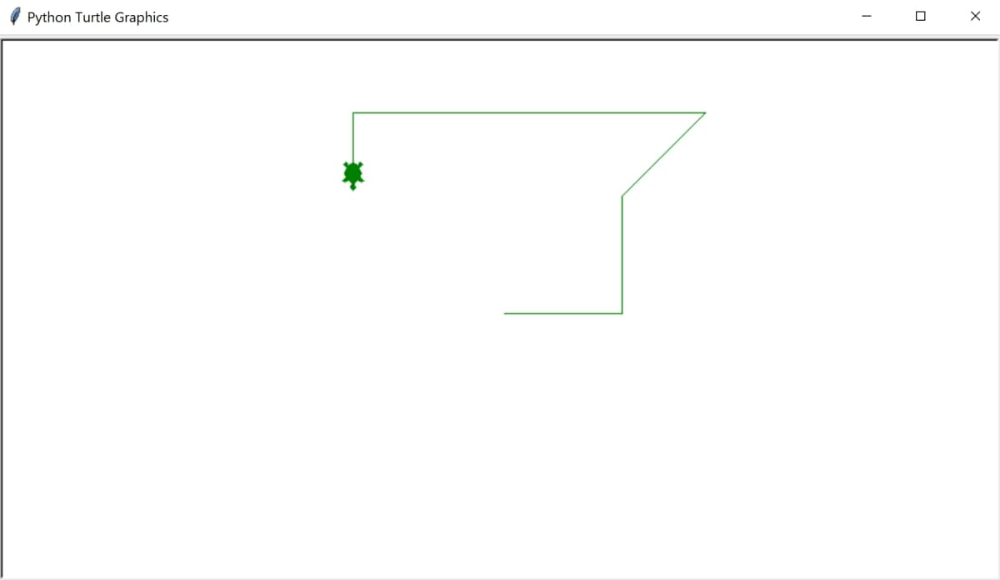

# python-turtles
This is a Python file with an example on how to create turtles

## To Run

* Navigate to the python-turtles folder in the command line or terminal.
* Run the script using the python command: `python shapes.py`

## Example

